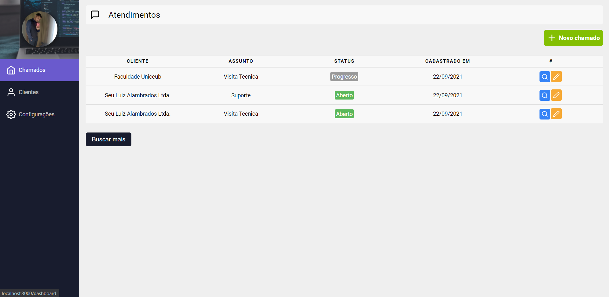

# Projeto Call System

## Sistema de chamados criado em react.js

## Disponibilizado através do Netlify

Link: https://call-system.netlify.app 

Aqui usei meu conhecimento adquirido no curso de react.js da Udemy.

Nessa aplicação usei tecnologias do Html, Css, Firebase e JavaScript junto a biblioteca React.js.

No React.js usei tecnologias como:

    Componentização,

    useState, useEffect, useContext e createContext do react,

    Link, useParams e useHistory do react-router-dom,

    react-icons/fi

    toast do react-toastify

Apliquei responsividade através de midia queries para dispositivos menores.

Através do Firebase foi possível salvar clientes, usuários e chamados, além de edita-los caso necessário.

Página de login

  

Página de cadastro

  

Página de cadastro com media queries

  

Página de perfil do usuário

  

Página cadastrar cliente

  

Página de chamados cadastrados

  

Página de detalhes dos chamados com media queries

  

Página de chamados com media queries

  

Página de novos chamados

  

## Pacotes usados: npm install react-router-dom, npm install firebase@^8.8.1, npm install --save react-toastify, npm install react-icons
